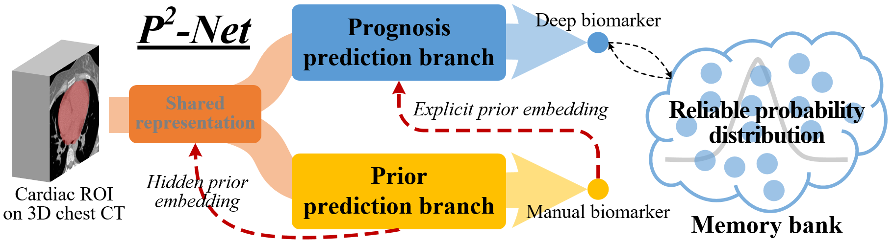

# P2-Net: Multi-task Learning for Pulmonary Arterial Hypertension Prognosis Prediction via Memory Drift and Prior Prompt Learning on 3D Chest CT

[NOTE!!]**The code will be gradually opened, and be completely opened after this paper is published.**

The P2-Net is a novel multi-task 3D prognosis prediction framework on chest CT images which advances the optimization of the prognosis prediction DL models and improve the perception of task-dependent features on low-contrast ROIs. Technically, it copes with two large challenges in DL-based 3D medical image prognosis model including unreliable loss caused by a large volume of 3D CT and the inefficient feature representation caused by low-contrast ROIs. This study on the embedding of prior knowledge via multi-task learning for task-dependent representation and the memory-based reliable distribution for robust optimization shows large superiority in the pulmonary arterial hypertension prognosis prediction.

<p align="center"></p>

## Paper
This repository provides the official PyTorch and MindSpore implementation of P2-Net in the following paper:

**Multi-task Learning for Pulmonary Arterial Hypertension Prognosis Prediction via Memory Drift and Prior Prompt Learning on 3D Chest CT** <br/> 
[Guanyu Yang*](https://cse.seu.edu.cn/2019/0103/c23024a257233/page.htm), [Yuting He](http://19951124.academic.site/?lang=en), Yang Lv, Yang Chen,  Jean-Louis Coatrieux, Xiaoxuan Sun, Qiang Wang, Yongyue Wei, [Shuo Li](http://www.digitalimaginggroup.ca/members/shuo.php), Yinsu Zhu* <br/>
Southeast University <br/>

## Official implementation
- [PyTorch/](https://github.com/YutingHe-list/P2-Net/tree/main/pytorch)
- [MindSpore/](https://github.com/YutingHe-list/P2-Net/tree/main/mindspore)

## Citation
If you use this code or use our pre-trained weights for your research, please cite our papers:
```
@article{yang2023multi,
  title={Multi-Task Learning for Pulmonary Arterial Hypertension Prognosis Prediction via Memory Drift and Prior Prompt Learning on 3D Chest CT},
  author={Yang, Guanyu and He, Yuting and Lv, Yang and Chen, Yang and Coatrieux, Jean-Louis and Sun, Xiaoxuan and Wang, Qiang and Wei, Yongyue and Li, Shuo and Zhu, Yinsu},
  journal={IEEE Journal of Biomedical and Health Informatics},
  volume={27},
  number={4},
  pages={1967--1978},
  year={2023},
  publisher={IEEE}
}
```

## Acknowledgments
This research was supported by the National Key Research and Development Program of China (2017YFC0109202), National Natural Science Foundation under grants (31800825, 31571001, 61828101), Excellence Project Funds of Southeast University, CAAI-Huawei MindSpore Open Fund and Scientific Research Foundation of Graduate School of Southeast University (YBPY2139). We thank the Big Data Computing Center of Southeast University for providing the facility support on the numerical calculations in this paper. 
